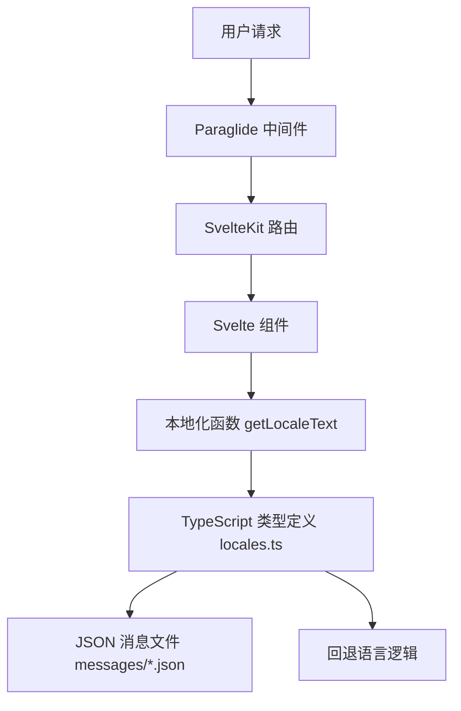

# 多语言架构概述

本文档提供了 Cyrene 项目多语言系统的整体架构和组件概述，帮助开发人员和翻译人员理解系统的工作原理。

## 系统架构概览

Cyrene 的多语言系统由以下几个关键组件组成：



## 关键组件

### 1. Inlang Paraglide-js 框架

Paraglide-js 是项目的核心多语言框架，提供了以下功能：

- **路由本地化** - 根据 URL 确定当前语言
- **消息格式化** - 处理消息模板和插值
- **SSR 支持** - 服务器端渲染时注入语言相关脚本
- **语言检测** - 基于 URL、Cookie 或 Accept-Language 头自动检测语言

相关文件：
- `src/lib/paraglide/` - Paraglide 生成的运行时代码
- `project.inlang/` - Paraglide 项目配置
- `src/hooks.server.ts` - 服务器端中间件集成

### 2. 自定义本地化系统

除了 Paraglide-js，项目还实现了一个自定义本地化系统，用于处理更复杂的文本内容：

- **类型安全** - 使用 TypeScript 定义完整的文本结构
- **分层组织** - 按功能模块组织文本内容
- **回退机制** - 当特定语言缺失时自动使用回退语言

相关文件：
- `src/lib/i18n/locales.ts` - 本地化类型定义和实现

### 3. 消息文件

消息文件使用 JSON 格式存储翻译内容，基于 Inlang 消息格式规范：

- `messages/en.json` - 英语（基础语言）
- `messages/zh-cn.json` - 简体中文
- `messages/zh-tw.json` - 繁体中文

## 数据流

当用户访问网站时，多语言系统的数据流如下：

1. **请求解析** - Paraglide 中间件从 URL 路径、Cookie 或 Accept-Language 头解析当前语言
2. **路由处理** - SvelteKit 处理路由并准备响应
3. **本地化获取** - 组件使用 `getLocaleText` 函数获取当前语言的文本
4. **类型匹配** - `locales.ts` 文件提供完整的类型定义，确保文本结构一致
5. **消息格式化** - 如需，使用 Inlang 消息格式化器处理模板和插值
6. **渲染** - 组件渲染带本地化文本的页面

## 文件结构

以下是项目中与多语言相关的关键文件结构：

```
d:/git/cyrene.xtower.site/cyrene-xtower/
├── messages/
│   ├── en.json
│   ├── zh-cn.json
│   └── zh-tw.json
├── project.inlang/
│   ├── settings.json
│   └── cache/
├── src/
│   ├── lib/
│   │   ├── i18n/
│   │   │   └── locales.ts
│   │   └── paraglide/
│   │       ├── messages/
│   │       ├── runtime.js
│   │       └── server.js
│   ├── hooks.server.ts
│   ├── hooks.ts
│   └── routes/
│       ├── +layout.svelte
│       └── +page.svelte
```

## 语言配置

### 支持的语言

当前项目支持以下语言：

| 代码 | 名称 | 状态 | 备注 |
|------|------|------|------|
| en | 英语 | 基础语言 | 所有翻译的基准 |
| zh-cn | 简体中文 | 默认语言 | 项目的默认语言 |
| zh-tw | 繁体中文 | 部分翻译 | 使用简体中文作为回退 |

### 默认语言

默认语言设置为 `zh-cn`（简体中文），可在 `src/lib/i18n/locales.ts` 中修改。

### 回退机制

系统实现了分层回退机制：

1. 首先尝试使用当前选择的语言
2. 如果该语言的翻译缺失，则使用默认语言 (`zh-cn`)
3. 如果默认语言的翻译也缺失，则使用基础语言 (`en`)

## 总结

Cyrene 项目的多语言系统结合了 Paraglide-js 框架和自定义本地化实现，提供了类型安全、灵活且易于维护的多语言支持。通过理解系统架构和组件之间的交互，开发人员和翻译人员可以更好地贡献和扩展项目。